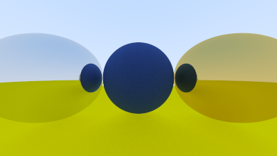

# Ray Tracer

Simple ray tracer made in C based on **["Ray Tracing in One Weekend"](https://raytracing.github.io/books/RayTracingInOneWeekend.html)**. Compiled using Clang 20.1.8 on Linux with the C99 standard.
This project has not been tested on Windows yet, but WSL should work without any issues.

## Instructions

- To compile, simply run the command `make`; 
- To run the program, run `make run`;
- To clean all the build files, use `make clean`;

To change the compiler from `Clang` to `GCC`, simply change the `CC` variable to the wanted compiler at the top of the makefile.