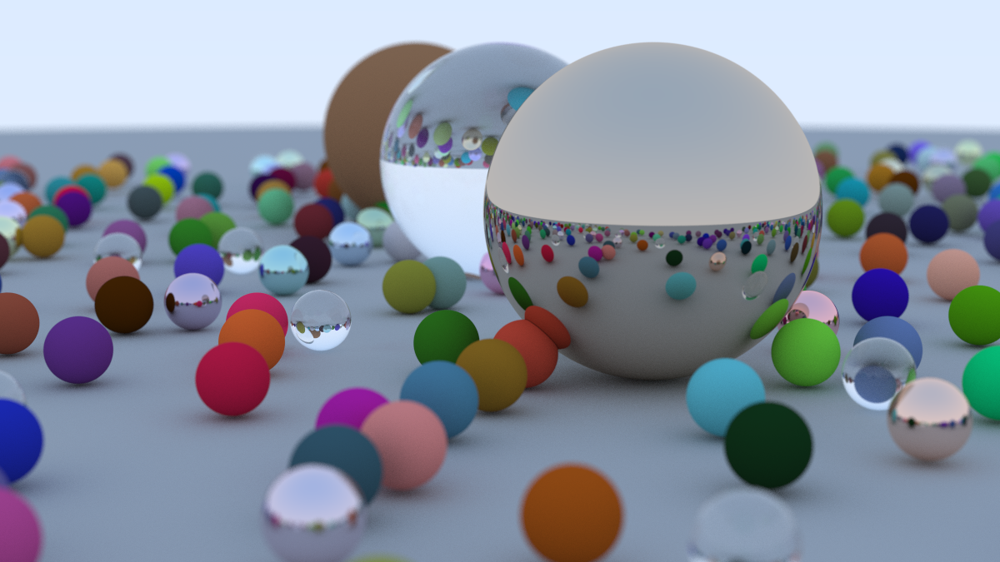

# Ray Tracer

Simple ray tracer made in C based on "Ray Tracing in One Weekend". Compiled using Clang 20.1.8 with C99 standard.x

## Instructions

- To compile, simply run the command `make`; 
- To run the program, run `make run`;
- To clean all the build files, use `make clean`;